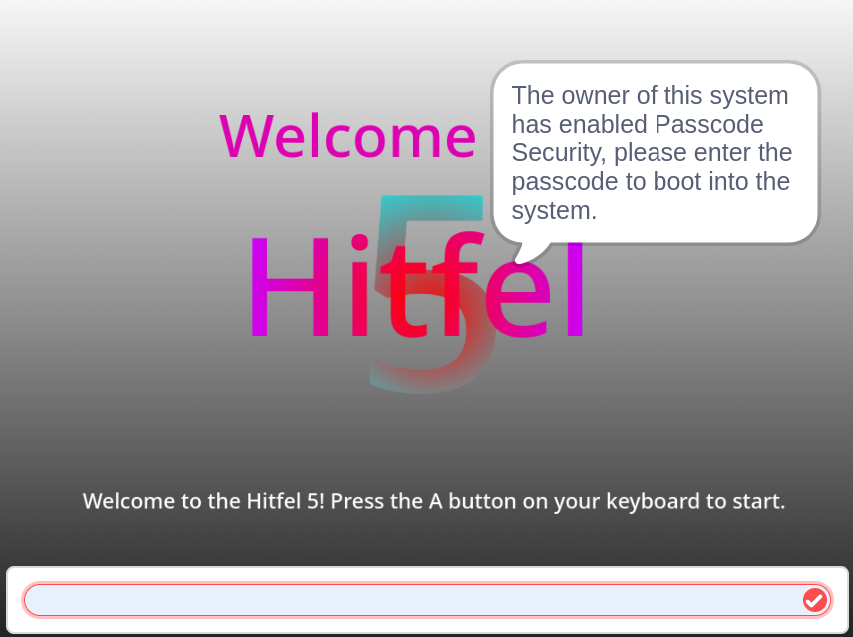

# Passcode Security

In the most recent version of the Hitfel 5, we released a smart security system called Passcode Security.

Passcode Security allows you to set up a passcode in your system. Once a passcode is set, you can only remove it by using the stock (stock as in not touched or modified at all) factory re-setters(such as getting an error, using Aurora, or using the Setup Utility).

When it is setup the following features require a passcode to access.

* Title Boot
* Awaking Sleep Mode
* Temporarily unlocking the system
* Factory Resetting (Aurora, Setup, Error)
* Changing the Passcode

.png>).png>).png>).png>)
